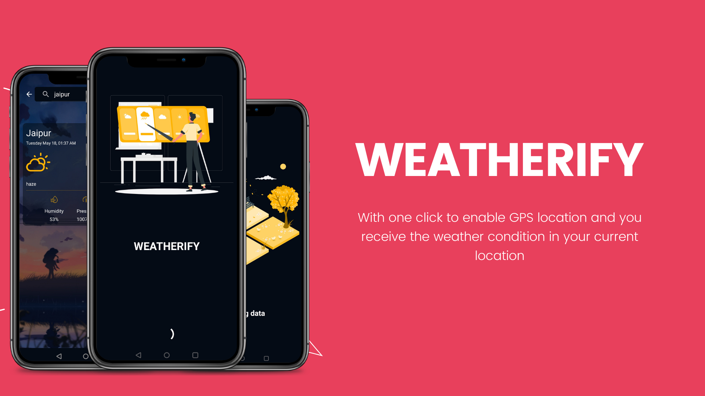
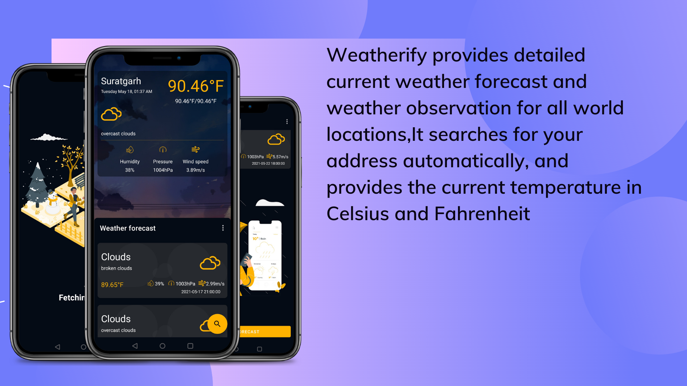
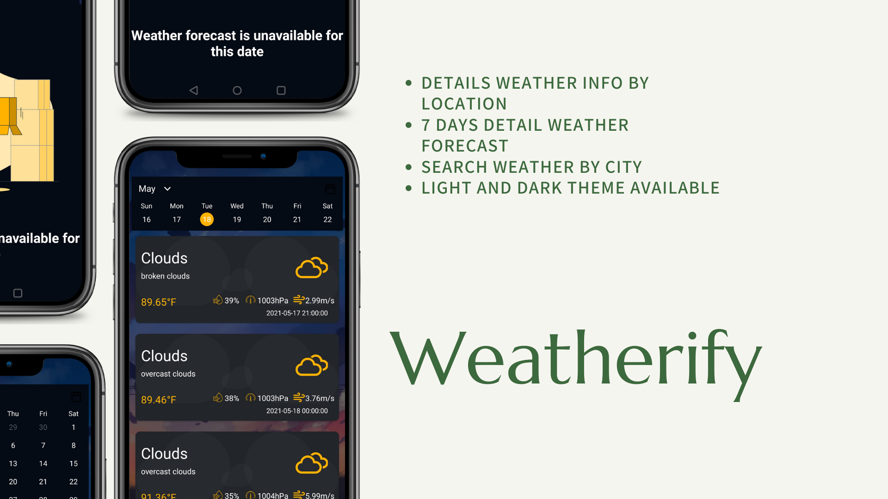

# Weatherify

 Weatherify fetches data from the OpenWeatherMap API to provide real time weather information.

# Setup API Key
- Visit openweathermap.org to get your API Key
- Open app/src/main/java/com/weather/weatherify/utils/Constants.kt 
- And add following line:

    const val API_KEY_VALUE = "your api key here"
  

# Technologies used

- Kotlin
- MVVM
- Dagger-hilt
- Navigation Components
- Retrofit2
- Glide
- openweather api
- Room
- Coroutines
- LiveData
- Material Design 

# Features
- Detailed Weather Info By Location
- Detailed weather Forecast
- Search weather By City
- Dark Theme available

# Screenshots

# Contribution
All contributions are welcome. If you are interested in seeing a particular feature implemented in this app, please open a new issue so after which you can make a PR!
